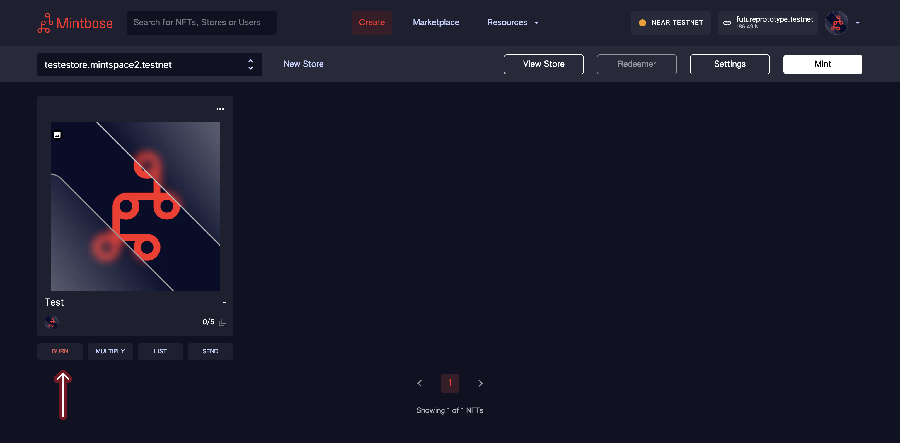

# Burning NFTs

After having [minted](minting-nfts.md) your NFT, you can burn it.

To burn an NFT, is to erase it. This has multiple use cases, like redeeming tickets for a concert. When entering the concert you would burn your ticket.


**Important:** once you burn your token it will be destroyed and you will have no way to recover it. Of course you can always mint a new one.


In the Create tab, click the **Burn** button under the NFT you want to burn.

A modal will pop up in the same page. Here you can input the amount of tokens you want to burn.

After filling out the burn amount, click **Continue** to be redirected to the NEAR wallet and approve the transaction.
