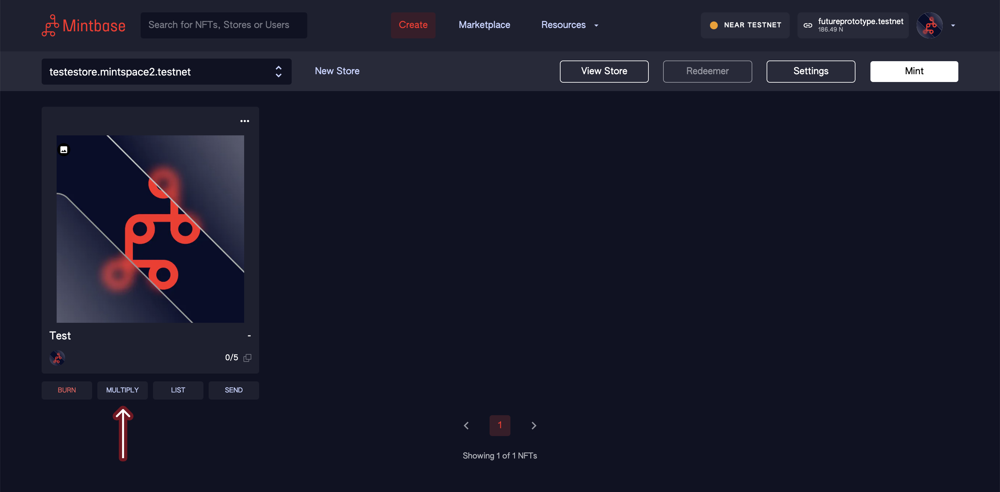

# Multiplying NFTs

After having [minted](minting-nfts.md) your NFT, you can multiply it.

In the Create tab, click the **Multiply** button under the NFT you want to make more of.

A modal will pop up in the same page. Here you can input the amount you wish to mint.

After clicking **Continue** you will be redirected to the NEAR wallet to approve the transaction.

Once you approve, you will see the success page and your tokens are minted.
