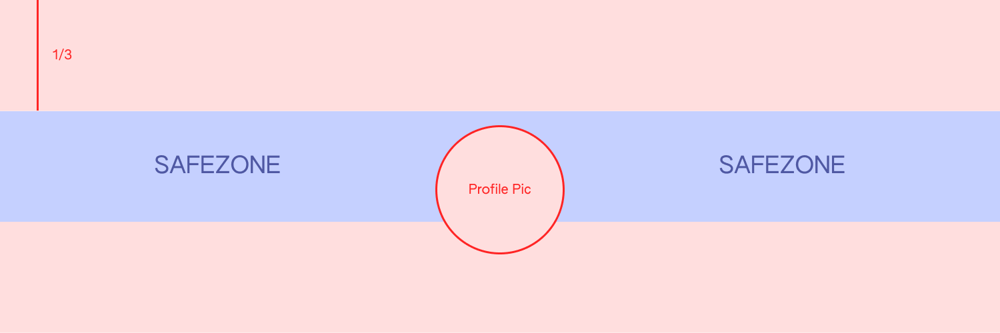

# User Settings

Click on the user image on the top right to open the dropdown menu and select **User Settings.**

## Basic Information

### E-Mail

Used for event notifications, like sales or auction bids. It's not displayed on your profile.

### Social Media Links

When filled, they will display on your Public Profile as buttons.

### Profile Image

Displayed on your Public Profile, and across Mintbase, when users search for your, or on NFTs that you own/mint. The accepted upload formats **** are **.png / .jpeg / .gif / .svg+xml.** The ideal dimension is **500x500px (1:1)** and the max accepted size is **500mb**.

### Header Image

Make your Public Profile shine with a nice header image. The accepted upload formats **** are **.png / .jpeg / .gif / .svg+xml.** The ideal dimension is **1500x500px (3:1)** and the max accepted size is **500mb**.

**Important:** Up to 2/3 of the header image may be cropped out on desktop screens, depending on how wide they are. **Consider a safezone of the center 1/3 of the image.**

## Notifications

Select the events for which you want to receive e-mail notifications for. You need to fill out your e-mail on the [Basic Information](user-settings.md#basic-information) for this to work.

## Default Color Theme

Choose the default theme for your account.

## Accounts

You can add different account on Mintbase. Here you can easily switch between them or erase them.
