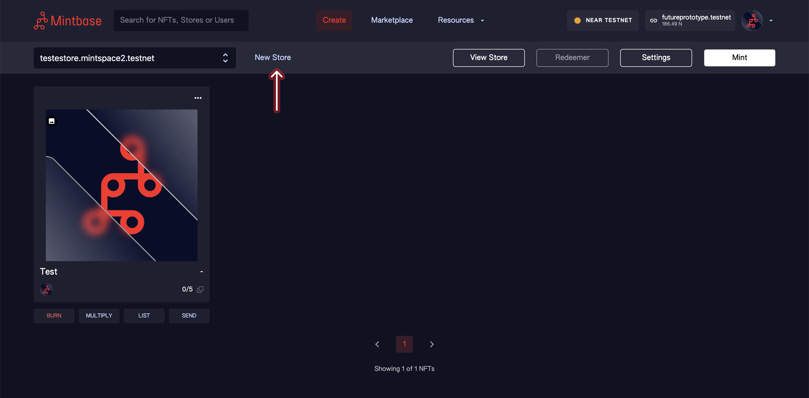

# Deploy

In the [Create](../minting/) tab, press **New Store.**

A modal will show up, with 2 fields you need to fill:

#### Store Name

The name of your store (must be unique and no spaces). You can't change this later.

#### Symbol

Create a symbol (Pretend you are listing your store on the NYSE and needed a [ticker](https://en.wikipedia.org/wiki/Ticker\_symbol) (4 letter symbol) to identify it.

After filling out both fields, click on **Deploy Store**. You will be redirected to your NEAR wallet, where you need to accept the transaction of 6.5 NEAR.

### Why 6.5 NEAR?

It costs 6.5 NEAR to deploy a store, **this goes to the NEAR blockchain and not Mintbase.** These are storage costs as you are paying to reserve space on the chain. You can see 602929 Bytes are used.

And if you click the Balance Profile you'll see there is 0.5 N left. Each time you mint, you take up more memory and this number will shrink. \
\
If your "Available" balance becomes too low,  just send more NEAR to your contract address (`soul4space.mintbase1.near` in the example above) and you'll be good to go.

###
