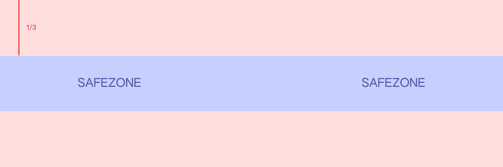

# Customizing your Contract

Click on the user image on the top right to open the dropdown menu and select **Contract Settings.**


**If you don't own a contract, you will not have the "Contract Settings" option in the menu.**


<figure><figcaption></figcaption></figure>

If you have multiple contracts, you can easily switch between the settings of each one:

.png>)

## Basic Information

#### Name

Customize the name of your contract, and how it appears around Mintbase.

#### Social Media and Website Links

When filled, they will display on your Contract as buttons.

#### Profile Image

Displayed on your Contract and across Mintbase. The accepted upload formats are **.png / .jpeg / .gif / .svg+xml.** The ideal dimension is **500x500px (1:1)** and the max accepted size is **500mb**.

#### Header Image

Make your Contract shine with a nice header image. The accepted upload formats are **.png / .jpeg / .gif / .svg+xml.** The ideal dimension is **1500x500px (3:1)** and the max accepted size is **500mb**.

**Important:** Up to 2/3 of the header image may be cropped out on desktop screens, depending on how wide they are. **Consider a safezone of the center 1/3 of the image.**

## Minters

Add minters to let people mint NFTs on your smart contract. Everyone you add here is able to mint and the NFTs will appear on your contract. They are not able to customize the contract settings.

You can add an infinite amount of minters, the more minters you add the more storage you use. Read about [data-storage.md](../additional-content/data-storage.md "mention").

## Default Royalties

You can set default royalties for every mint on your contract. This is interesting for when you have multiple minters minting on your contract. When you set Default Royalties, every time they mint, the royalties will be set on the NFT, and they can't edit them.

While minting, it is possible to add more royalties besides the default one (except if you set Default Royalties of 50%, which is the max. amount).

[Click to learn how Forever Royalties work](https://docs.mintbase.io/creating/minting/minting-nfts#forever-royalties)

## Default Split Revenues

Same as described above, but for Split Revenues.

[Click to learn how Split Revenues work](https://docs.mintbase.io/creating/minting/minting-nfts#split-revenues)

## Transfer Contract Ownership

Transfer your contract to another NEAR account.

**This is a permanent action** that will remove your ownership of the contract - you won't be able to mint, customize or do anything with it.

