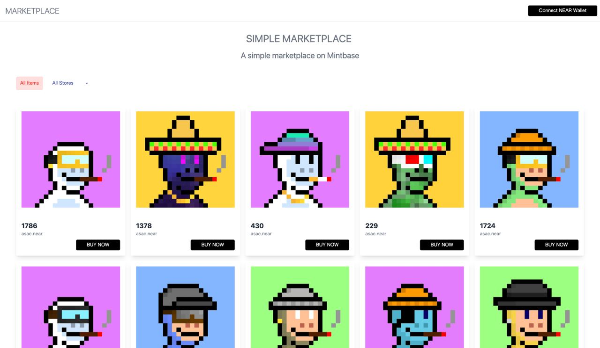

# 📄 Examples

Get building fast with our ready to deploy dapps.

<mark style="color:red;">These examples are currently being updated to use the newest version of our SDK.</mark>

### **simple-marketplace**

A Simple Marketplace where you can list and buy tokens that are available and filter selection by store.

This allows you to easily create your own niche marketplace where you have total control over curation. With access to all tokens being minted via our indexer, it is easy to select and aggregate the markets of your choosing.

\
\
built with Next.js + mintbase.js + Apollo\
\
Github Docs: [https://github.com/Mintbase/examples/tree/main/simple-marketplace](https://github.com/Mintbase/examples/tree/main/simple-marketplace)\
Live Demo: [https://examples-simple-marketplace.vercel.app/](https://examples-simple-marketplace.vercel.app/)

<figure><figcaption></figcaption></figure>

### **simple-minter**

A Simple Minter example, where you can mint NFTS to your store.\
\
built with Next.js + mintbase.js + Apollo\
\
Github Docs: [https://github.com/Mintbase/examples/tree/main/simple-minter](https://github.com/Mintbase/examples/tree/main/simple-minter)

Live Demo: [https://examples-simple-minter.vercel.app/](https://examples-simple-minter.vercel.app/)

<figure><figcaption></figcaption></figure>
