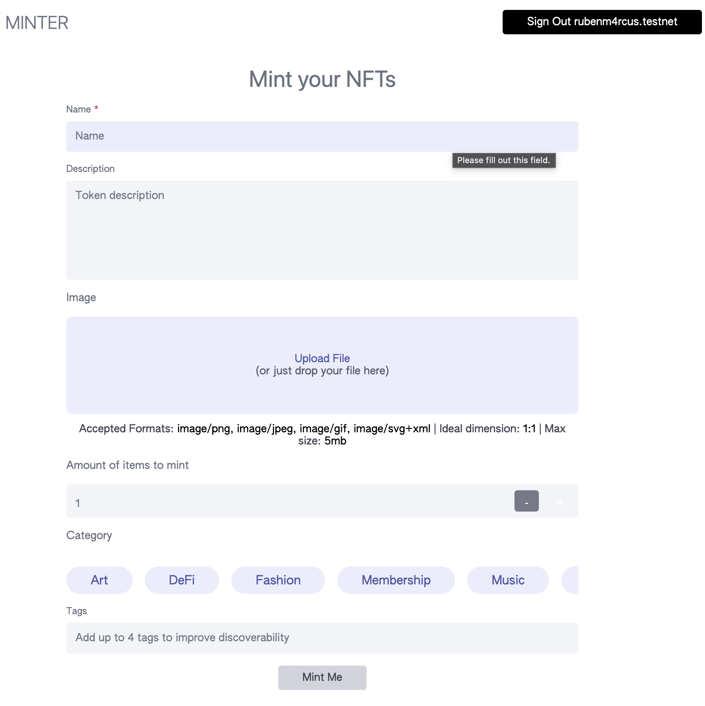

# simple-minter

A Simple Minter example, where you can mint NFTS to your store.\
\
built with Next.js + mintbase.js + Apollo\
\
Github Docs: [https://github.com/Mintbase/examples/tree/main/simple-minter](https://github.com/Mintbase/examples/tree/main/simple-minter)

Live Demo: [https://examples-simple-minter.vercel.app/](https://examples-simple-minter.vercel.app/)

<figure><figcaption></figcaption></figure>
