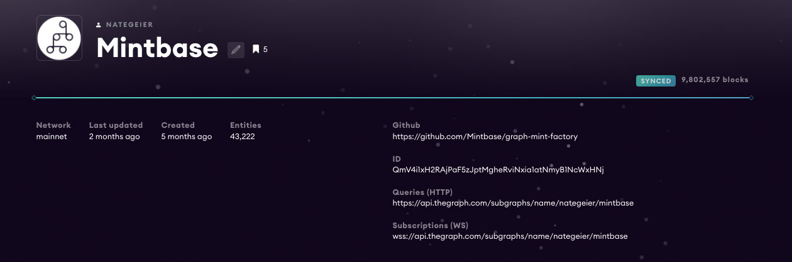

# Token Data



### Using TheGraph

[TheGraph](https://thegraph.com/) is an Ethereum indexer that stores aggregated data on [IPFS](https://ipfs.io/) directly from the Ethereum blockchain. When you change the state of the blockchain (mint, transfer, buy, or burn) an event is emitted and then [organized](https://github.com/Mintbase/graph-mint-factory) by our [open sourced mapping tool](https://github.com/Mintbase/graph-mint-factory). Our entire interface hooks into the open query using polling on our React app with Apollo GraphQL, and updates on blockchain confirmations. You can also build your own reporting systems from this.


Mainnet Subgraph: [https://thegraph.com/explorer/subgraph/nategeier/mintbase](https://thegraph.com/explorer/subgraph/nategeier/mintbase)



Rinkeby Subgraph: [https://thegraph.com/explorer/subgraph/nategeier/mint-factory](https://thegraph.com/explorer/subgraph/nategeier/mint-factory)


```
// Websocket
wss://api.thegraph.com/subgraphs/name/nategeier/mintbase

// Query
https://api.thegraph.com/subgraphs/name/nategeier/mintbase

```



Getting the metadata for a token 



```
{
  "minter": "0x87085d8d22d688e7ac9da3384127169f83e059e6",
  "mintedOn": "2020-06-02T22:16:28.820Z",
  "contractAddress": "0x0163f249af5a4781cd09edeb2326066b9552d8ec",
  "minted": "Minted on Mintbase.io",
  "fiatPrice": "$24.02",
  "name": "99 • Mars-Man",
  "description": "We are not perfect. We were not made by computational probabilities and mathematical calculations. We are the product of pure fun. That is why WE ARE UNIQUE.",
  "youtube_url": "",
  "price": "$0.00",
  "ethPrice": "0.1",
  "amountToMint": 1,
  "forSale": true,
  "image": "https://arweave.net/8h12K69ndc0ZSfLuaSFq2-Gk6ShS9byqr7B2rUNbFU8",
  "attributes": [
    {
      "trait_type": "rarity",
      "value": "e02HZ3Ifqk5gPOghuA7t"
    },
    {
      "trait_type": "location",
      "value": "Mexico"
    },
    {
      "trait_type": "place_id",
      "value": "ChIJU1NoiDs6BIQREZgJa760ZO0"
    },
    {
      "trait_type": "website",
      "value": "www.ultrapop.xyz"
    },
    {
      "trait_type": "Side",
      "value": "Rudo"
    },
    {
      "trait_type": "Technique",
      "value": "Martian Scissors"
    },
    {
      "trait_type": "Shape",
      "value": "Triangle"
    }
  ],
  "category": "alJuInV4dezvHTNU8Dp1",
  "external_url": "https://mintbase.io/my-market/0x0163f249af5a4781cd09edeb2326066b9552d8ec",
  "type": "ERC721"
}
```



#### &#x20;**Exam**ple:




Your can also find the metadata at the end in the url on the Pez Dispenser  link




### Tracking Your Store

[Click the drop down here ](https://thegraph.com/explorer/subgraph/nategeier/mintbase?query=NFT%20NYC)and you can see example, but just enter your created contract (make sure it's all lowercase)&#x20;


### Things vs Token

A Thing is the batch of tokens (like a cup of coffee) and a Thing will have many  to it tokens (15 tokens of a Thing). All these tokens are sharing the same metaId which is the unique idea for a Thing.&#x20;

### Token State:

You'll notice in our graph under s=tokens there is a state field, this is what helps us sell or not sell an item using the `buyThing` function. If a user sets a price and is for sale anyone can grab that NFT if they throw the price or greater. If no price is set and the token is set for sale, anyone can grab them for free, they just need to pay the transfer gas cost.

| State | Type         | What the state does                                                               |
| ----- | ------------ | --------------------------------------------------------------------------------- |
| 0     | Not for Sale | The token can only be airdropped by the minter                                    |
| 1     | For Sale     | Anyone can grab the token using the `buyThing` function if enough ETH is sent     |
| 2     | Sold         | Sold and cannot go up for resale on Mintbase, `buyThing` function no longer works |
| 3     | Transferred  | Sent after minting  `buyThing` function no longer works                           |

### Using React + Apollo

We use Apollo on our React app front end for https://mintbase.io that hooks into the graph query url



### Realtime Data

We suggest using polling over subscriptions on your quries as theGraph has shown some major delays and websockets can be a nightmare. It's pretty easy to setup.

```typescript
  import { useQuery } from "@apollo/react-hooks";
  
  // Gets all stores from a users eth account
  // Note to always use lowercase when quiering the graph
  const useableAccount= '0x66268791b55e1f5fa585d990326519f101407257`
  const [{ loading, data }] = useQuery(GET_STORES, {
    variables: { id: useableAccount, approver: process.env.approver },
    pollInterval: 900
  });
```

