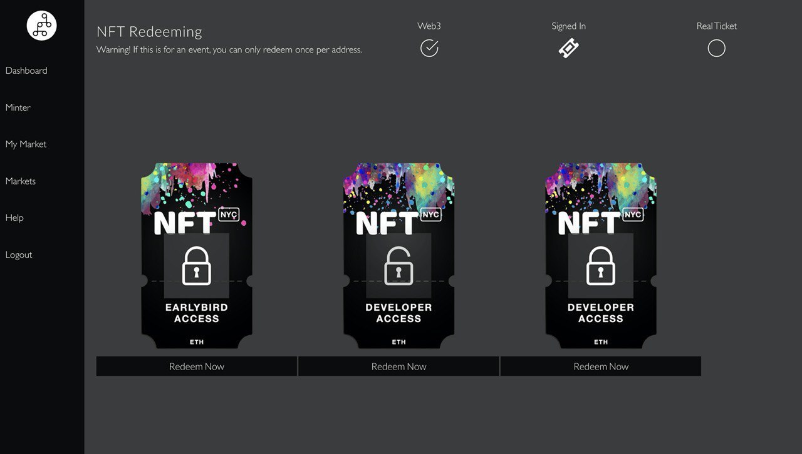

# Redeeming tickets/ NFTs

Every person who creates a shop (smart contract) can also use our redeemer.&#x20;

In the minter, select redeemer.

The redeemer looks like this.&#x20;

Ask your customer where the ticket (NFT) is stored. Is it on Trust, Argent or any other WalletConnect compatible wallets, select Wallet Connect. If the ticket is stored on Coinbase Wallet, select Coinbase.

If you select WalletConnect, you get this QR code.

Tell your customer to scan this with their QR code. Below is an example where to find the scanner on Trust Wallet (symbol next to collectibles, top right).

Let the customer scan the QR code. The ticket  should automatically appear on your dashboard.

Confirm the transactions and click redeem if you want to redeem the ticket.

The NFT gets sucked out of the wallet's user which is bound to the smart contract.

Once you suck out the NFTs you can press "Redeem Now" and the customer will see a message appear on their device requesting them to sign a message, Once signed you'll see the item gets unlocked and they have redeemed the item. Let that human on in!
