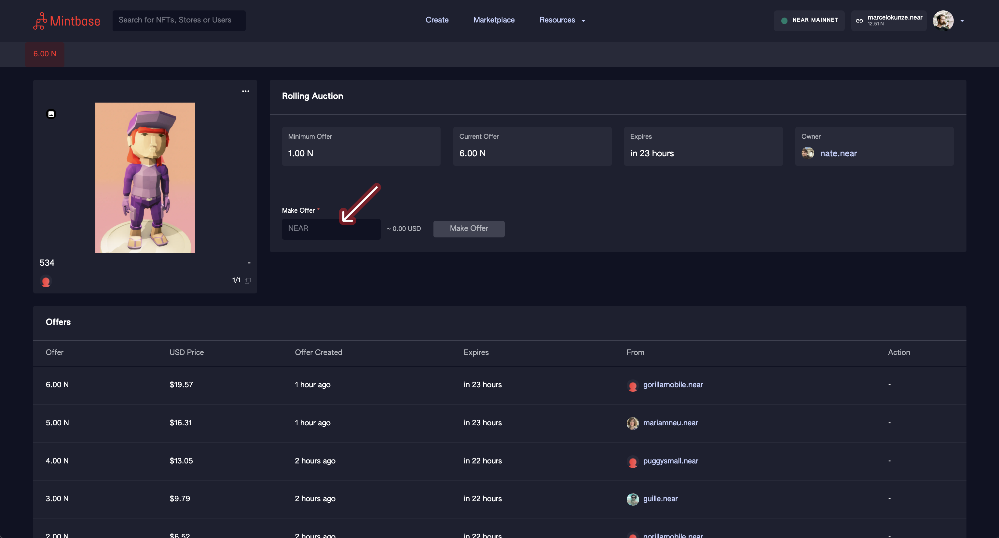

# Rolling Auctions

## Video Walkthrough


Video Walkthrough of a Rolling Auction


## Text Walkthrough

On the Thing Page, check the Rolling Auction section to see if any tokens are listed via auction (like in the example below).

Click the **See Auctions** button to go to the auctions page.

### Rolling Auction Page

There are some things going on here, so let's break them down:

#### **Minimum Offer**

The lowest amount you can input as a bid. In the example above it's 1 NEAR.

#### **Current Offer**

The current offer that is winning the auction. The auction only ends, if the Owner accepts an offer.

#### **Expires**

How much time the Owner has to accept the offer (each bid lasts 24 hours). After this time the offer expires, and can't be accepted anymore.

#### **Offers**

In this table you can visualize the offer history on the specific token.

### Rolling Auctions with multiple tokens

If more than 1 token is listed as Rolling Auction, you can navigate between them in this upper tab:

.png>)

In this example there are 4 tokens of the same thing ([read here about things/tokens](thing-page.md)) listed as Rolling Auction. Three tokens don't have offers (EMPTY) while one token has an offer of 3 NEAR, that is currently selected.

The empty ones will appear first, because there you have more chance of winning the auction. Simply select the token you want to bid on.

### How to make an offer

While logged in, type in your offer in the Make Offer field. It needs to be higher then the Minimum and Current offers.

After you typed the **Make Offer** button will become active. Click it an you will be redirected to the NEAR wallet to validate the transaction. After this your offer is recorded on the blockchain.


There is no way to withdraw an active offer after it's been made.


### After you make an offer

When you make an offer, your funds get into escrow and there are 3 things that can happen:

#### **1. The owner accepts your offer**

In this case your funds go to the owner and you got yourself a new NFT. Nice!

#### **2. Your offer get overtaken**

Someone made an offer higher than yours. In this case, you don't need to do anything and your funds get back to you automatically.

#### **3. Your offer expires**

You have the highest offer but after 24 hours the Owner has not accepted it. **In this case, you need to manually withdraw your offer from escrow.** Two ways to do it:

* On the Rolling Auction page, in the Offers table, find your offer and click **Withdraw.**
* Click your profile picture in the navbar (or on mobile on the hamburger menu) and click on **Earned & Orders.** On the tab navigate to **Open Orders.** In the My Offers table, click **Withdraw.**

### Keep in mind as an buyer:

* When you bid, you put your NEAR into escrow
* When you get outbidded, your funds are automatically released from escrow
* The owner of the listing can accept anytime within 24 hours of the offer
* After an offer you placed expires, you can pull back your NEAR from escrow by pressing **Withdraw** on the Rolling Auction page, or on the Open Orders page (which you can find clicking on your profile picture on the navbar).


After an offer you made expired, your funds will be kept in escrow until you make the manual withdraw.


### Keep in mind as an seller

* You have 24 hours to accept a bid. If the bid expires there is no way to accept it
* Turn on your e-mail notifications (on the [User Settings Page](../creating/sign-in/user-settings.md)) for being notified whenever a bid happens
